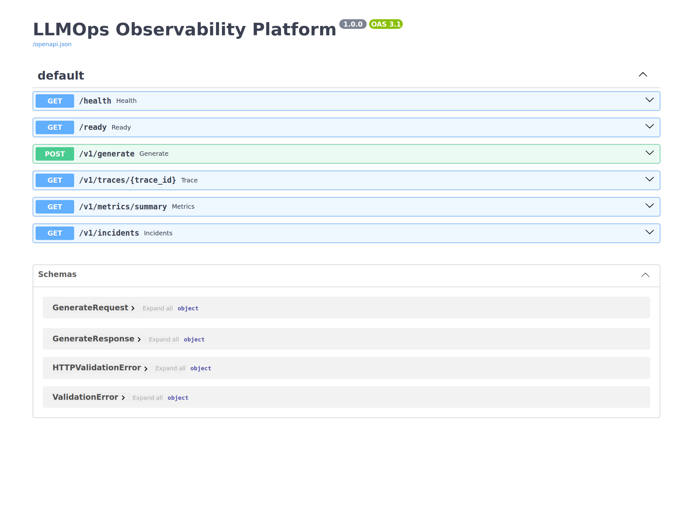
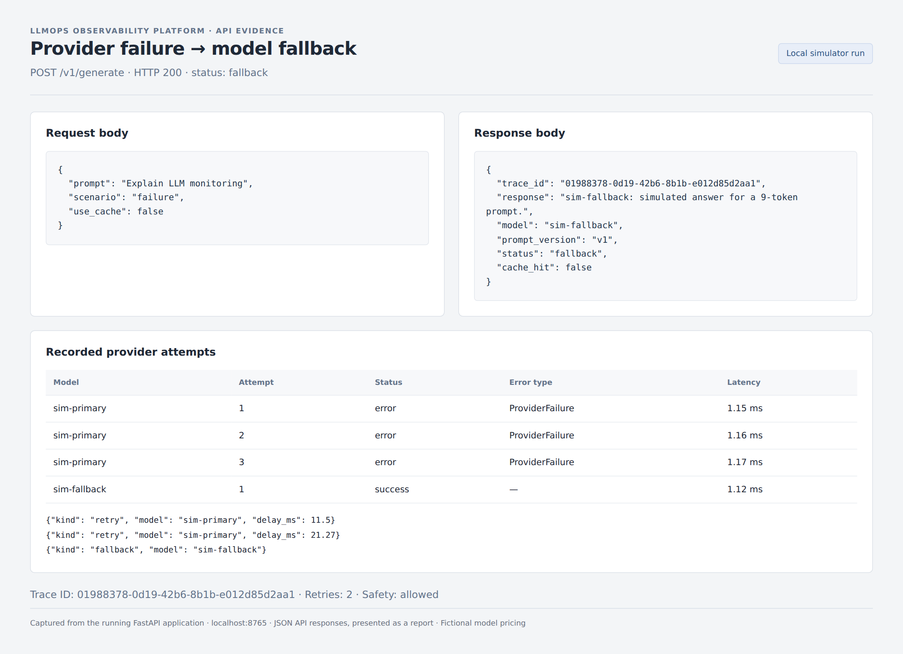
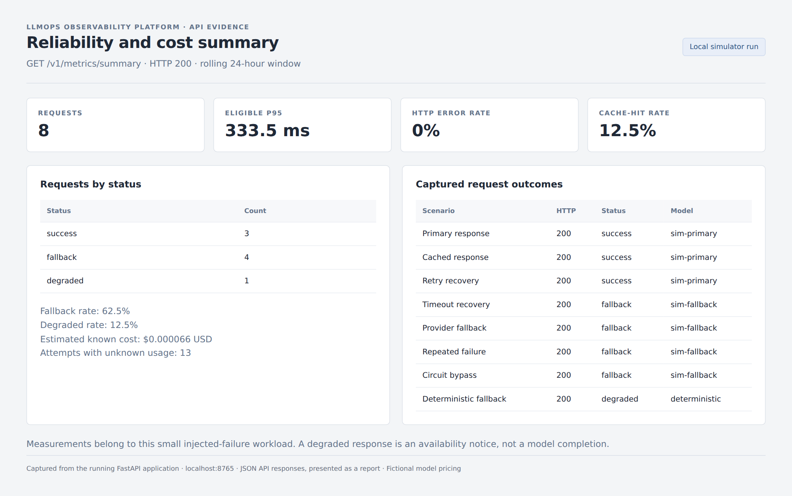

# LLMOps Observability Platform

A Python/FastAPI LLM gateway that demonstrates how to run, observe, and recover an AI service. It records each generation request in SQLite and exposes reliability and cost metrics through APIs. Both model adapters are simulators: **no API key, paid model, or external service is required.**

## Demo screenshots

These screenshots show a local demo using simulated LLM providers.
The trace and metrics reports use actual API responses from the demo.

### API documentation

Available endpoints for generation, health checks, traces, metrics, and incidents.



### Provider failure and fallback recovery

The primary model fails, the gateway retries twice, and the fallback
model returns a successful response. Each attempt is recorded in the trace.



### Reliability and cost metrics

Results from eight demo requests covering cache hits, retries, timeouts,
model fallback, circuit breaking, and deterministic fallback.



## What you can demonstrate

- Request IDs, prompt versions, model attribution, latency, estimated tokens and fictional USD costs.
- Per-attempt events, exponential backoff with jitter, deadlines, and primary/fallback circuits.
- A single half-open recovery probe; stale in-flight results cannot close a newly opened circuit.
- Bounded TTL/LRU cache and per-peer-IP sliding-window quotas, including cached requests.
- Primary → fallback model → explicit deterministic `degraded` response.
- Input/output safety outcomes and metadata-only traces without stored prompts or completions.
- Durable traces, paginated incident events, readiness, and a metrics API dashboard.
- A reliability regression gate and GitHub Actions test/release workflows.

## Quick start

Use Python 3.11 or 3.12. From the extracted repository folder:

```bash
python -m venv .venv
source .venv/bin/activate
# Windows PowerShell: .venv\Scripts\Activate.ps1
python -m pip install -r requirements-dev.lock
python -m pip install -e . --no-deps
python -m uvicorn app.main:app --host 127.0.0.1 --port 8000 --workers 1 --no-proxy-headers
```

Open [Swagger API docs](http://127.0.0.1:8000/docs). The lock file records the dependency versions validated for this release. `pip install -e '.[dev]'` is an alternative that resolves newer compatible versions.

```bash
curl -X POST http://127.0.0.1:8000/v1/generate \
  -H 'Content-Type: application/json' \
  -d '{"prompt":"Explain model monitoring","prompt_version":"v1"}'

# Provider failure: two retries, then the fallback model.
curl -X POST http://127.0.0.1:8000/v1/generate \
  -H 'Content-Type: application/json' \
  -d '{"prompt":"Explain model monitoring","scenario":"failure","use_cache":false}'

curl http://127.0.0.1:8000/v1/metrics/summary
curl http://127.0.0.1:8000/v1/incidents
```

Every generation response includes `X-Trace-ID`, including 400, 401, 422, 429, and contained 500 errors. Successful responses also return `trace_id` in the JSON body. Retrieve it at `/v1/traces/{trace_id}`.

## Failure simulator

| Scenario | Behavior |
|---|---|
| `success` | Returns a deterministic simulated answer |
| `slow` | Sleeps 50 ms, then succeeds with the default deadline |
| `timeout` | Sleeps 60 seconds; the gateway cancels each attempt after 100 ms |
| `failure` | Raises a retryable provider error on every attempt |
| `flaky` | Fails the first attempt and succeeds on retry |
| `unsafe` | Returns a marker rejected by the demonstration output policy |

Use `fallback_scenario` to independently fail or delay the fallback adapter. `scenario=failure` plus `fallback_scenario=failure` returns a safe availability message with `status=degraded`. It does **not** claim the user's task was completed. Put `[blocked-input]` in a prompt to trigger input rejection. This marker policy is a test fixture, not real moderation.

## Run the demo and tests

```bash
# Self-contained scenario walkthrough; uses a temporary SQLite database.
python -m scripts.demo --in-process

# Against the running service:
python -m scripts.demo --base-url http://127.0.0.1:8000

python -m pytest
python -m ruff check .
python -m ruff format --check .
```

[`examples/demo-report.json`](examples/demo-report.json) is an actual generated walkthrough. It includes request outcomes, selected traces, metrics, and incident events. [`docs/validation.md`](docs/validation.md) records the release verification. The regression test checks a 30-request failure workload, p95 below 500 ms, model fallback, absence of 5xx responses in that workload, and a 429 after the quota is exhausted. These are controlled test results, not measured internet-service guarantees.

## API dashboard

| Endpoint | Purpose |
|---|---|
| `POST /v1/generate` | Generate with resilience controls and a trace ID |
| `GET /health` | Process liveness |
| `GET /ready` | SQLite write-lock check and circuit states |
| `GET /v1/traces/{trace_id}` | One metadata-only request trace |
| `GET /v1/metrics/summary?window_minutes=1440` | Counts, p50/p95, rates, and cost by attempted model |
| `GET /v1/incidents?limit=50&before_id=123` | Recent incident events with cursor pagination |

Metrics use a rolling window (1 minute–7 days). Costs include successful provider attempts, including blocked output; cache hits add no new model cost. Failed/timeout attempt usage is flagged unknown instead of being presented as free. See [SLIs/SLOs](docs/slo-sli.md) for exact denominators and latency boundaries.

## Configuration

| Environment variable | Default | Purpose |
|---|---|---|
| `GATEWAY_DB_PATH` | `data/gateway.sqlite3` | Persistent SQLite path |
| `GATEWAY_API_KEY` | empty | Optional shared `X-API-Key` for all `/v1/*` routes |
| `GATEWAY_ALLOW_SIMULATION` | `true` | Permit failure scenario injection |

`Settings` in `app/config.py` also controls deadlines, retry count, backoff, quotas, cache bounds, and circuit cooldowns. These are intentionally explicit Python settings rather than a partially implemented environment parser. `uvicorn` does not automatically load `.env.example`; export variables in your shell or inject them through your container runtime.

## Docker

```bash
docker build -t llmops-observability-platform:1.0.0 .
docker run --rm -p 127.0.0.1:8000:8000 -v llmops-data:/app/data \
  -e GATEWAY_API_KEY=replace-with-a-long-random-secret \
  llmops-observability-platform:1.0.0
```

The container runs as a non-root user with one worker and a persistent data volume. Docker is an optional delivery path; local Python is enough.

## Operations and boundaries

- [Architecture](docs/architecture.md)
- [SLOs and SLIs](docs/slo-sli.md)
- [Incident runbook](docs/incident-runbook.md)
- [Security guidance](docs/security.md)
- [Cost control](docs/cost-control.md)
- [Release and rollback](docs/release.md)

This is a production-oriented **single-worker reference project**, not a horizontally scaled service. Cache, quotas, and circuits are in memory and reset on restart. SQLite is suitable for this small demonstration; use shared storage and distributed controls before adding workers or replicas. Readiness remains true during provider failures because fallback paths still serve explicit results. No real provider, distributed tracing exporter, background alert delivery, or autonomous incident remediation is implemented.

## Publish to GitHub

Create an empty repository named `llmops-observability-platform`, then run these commands from this folder, replacing `YOUR_USERNAME`:

```bash
git init -b main
git add .
git commit -m "Build LLMOps gateway with observability and resilience"
git remote add origin https://github.com/YOUR_USERNAME/llmops-observability-platform.git
git push -u origin main
git tag v1.0.0
git push origin v1.0.0
```

CI runs on pushes and pull requests. The tag workflow reruns validation, checks that the tag matches `pyproject.toml`, and creates a GitHub Release with a source archive. This folder has not been uploaded to a GitHub account.

License: MIT.
