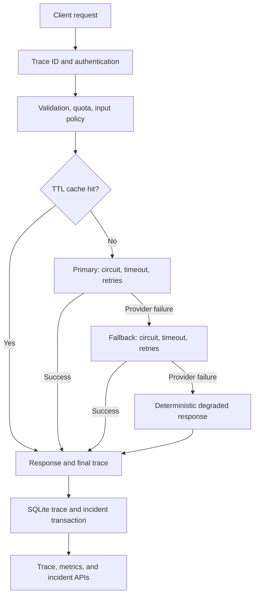

# Architecture

Output policy checks occur on both model paths before returning or caching text. Blocked output returns 400 immediately and is never retried through a weaker policy. Only successful primary output enters the cache. Cache identity includes peer identity, full composed prompt, prompt version, model, and both simulation scenarios. No plaintext prompt or response is persisted in SQLite.

`app/main.py` initializes SQLite and the gateway through FastAPI lifespan. Middleware creates the generation trace before validation and authentication, then persists its outcome before returning the response. Generation body fields are validated with Pydantic. SQLite work runs in `asyncio.to_thread`, keeping its blocking operations off the event loop. Parameterized SQL, short-lived connections, WAL mode, and a one-second busy timeout support modest concurrent traffic.

`app/gateway.py` orchestrates providers through the `LLMAdapter` protocol. It retries only timeout and `ProviderFailure` exceptions. Unknown adapter exceptions become a contained 500 and retain only the exception type. A real adapter must translate transient provider failures into `ProviderFailure`, use cancellation-friendly async I/O, set transport deadlines, and return usage. Authentication or permanent input errors should not be translated into retryable failures.

Each model has a separate breaker. Three exhausted logical calls open it by default; individual retry attempts are recorded but do not each count toward that threshold. After five seconds, one half-open probe is admitted. A failed probe restarts the cooldown; a successful probe closes the circuit. Epoch checks prevent stale requests admitted before an opening from resetting the new state. A cancelled probe releases its reservation.

The rate limiter uses sliding windows by peer IP with 30 accepted requests/minute. Active identities are bounded at 1,024; when full it rejects a new identity instead of evicting an existing quota. The TTL cache holds at most 512 entries for 60 seconds. These operations execute synchronously on one event loop before any await.

Traces contain indexed relational fields plus a JSON payload with attempts and events. Incident rows are event records linked to traces, not deduplicated incident-management tickets. Trace and incident insertion is atomic. A generation persistence failure returns 503 and logs its trace ID, but cannot produce a durable trace in unavailable storage. Cancelled/abandoned requests are not guaranteed a completed trace. Graceful shutdown, an external request log, and durable telemetry queues are extensions for a real deployment.

Metrics scan traces within the selected time window and calculate nearest-rank percentiles in memory. This is intentionally simple and should be replaced with SQL aggregates/histograms or a metrics backend at high volumes. SQLite retention is an operator responsibility; the project does not silently delete evidence.

## Default deadline budget

Both providers get three attempts of at most 100 ms. Each has two backoffs of roughly 10 and 20 ms (±20% jitter). If both time out, the simulated model path takes at most approximately 672 ms plus scheduling, validation, and persistence overhead. `asyncio.wait_for` waits for cooperative cancellation; a provider that suppresses cancellation could exceed this budget. There is no separate global request deadline or ingress concurrency limit in this reference project.

## References

- [FastAPI lifespan](https://fastapi.tiangolo.com/advanced/events/)
- [FastAPI lifespan testing](https://fastapi.tiangolo.com/advanced/testing-events/)
- [Python asyncio cancellation and wait_for](https://docs.python.org/3/library/asyncio-task.html)
- [Python SQLite transactions and timeouts](https://docs.python.org/3/library/sqlite3.html)
